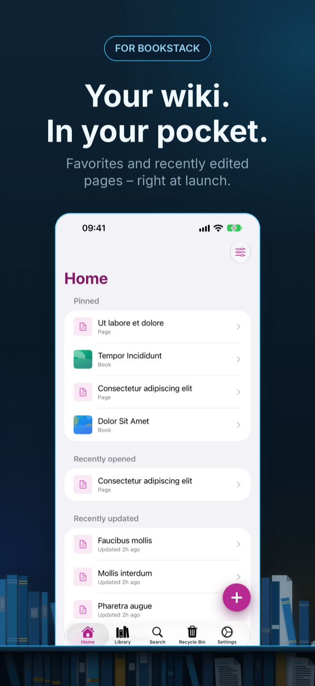
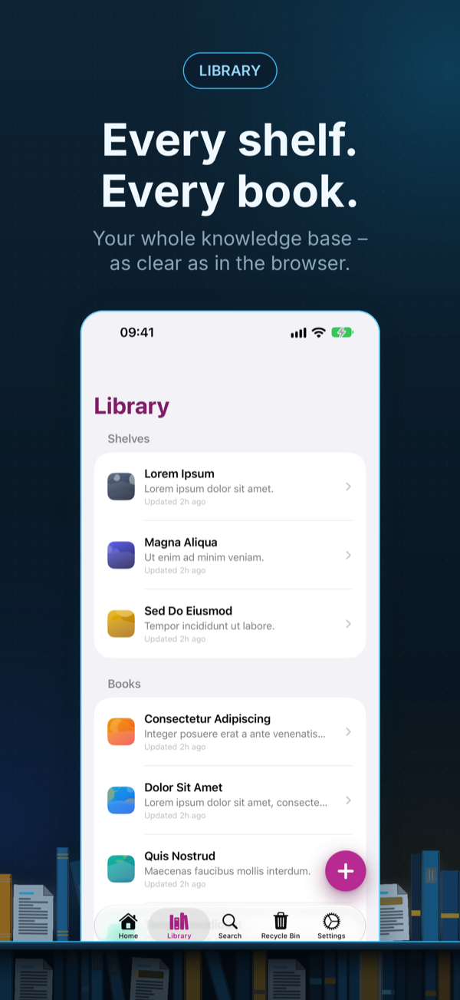
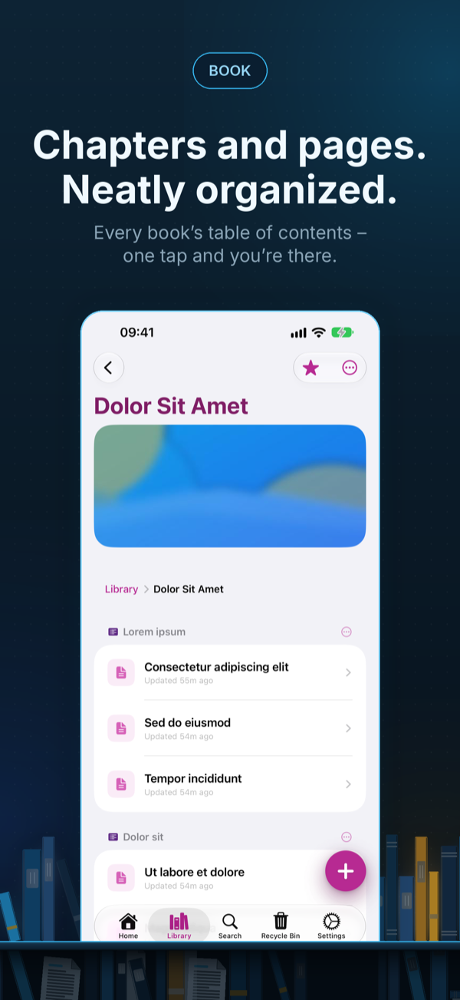
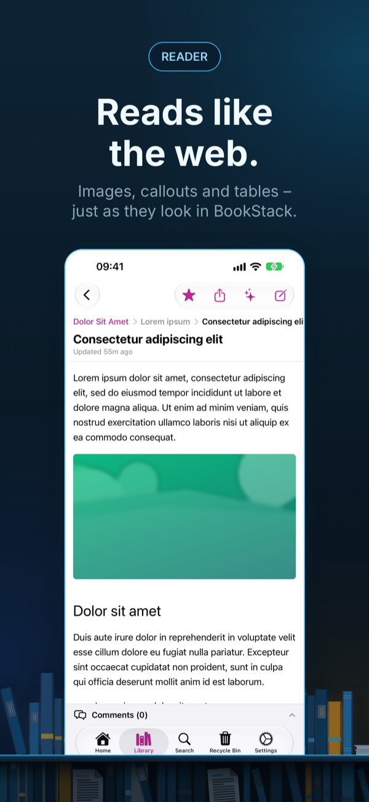
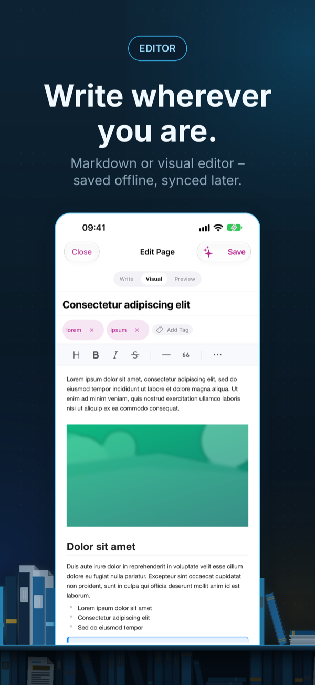
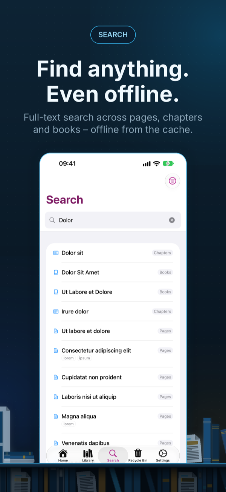
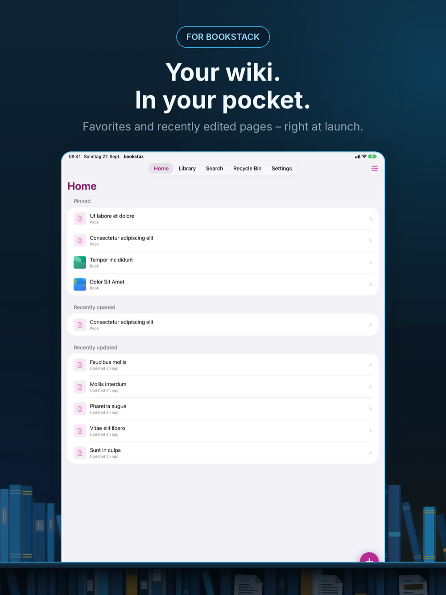

  

<h1 align="center">BookStax</h1>

  <strong>An unofficial, independent app for <a href="https://www.bookstackapp.com">BookStack</a>.</strong> 
  Not affiliated with, developed, endorsed or reviewed by the maintainers of BookStack.

<strong>Your BookStack wiki. On iPhone and iPad.</strong>

  A native SwiftUI client for <a href="https://www.bookstackapp.com">BookStack</a> — read, write and search your self-hosted wiki on iPhone and iPad.

  <a href="https://apps.apple.com/app/id6761068485?pt=128697224&ct=github-readme&mt=8">Download on the App Store</a>
  ·
  <a href="https://www.bookstax.app/en/">Website</a>
  ·
  <a href="https://www.bookstax.app/en/changelog/">Changelog</a>
  ·
  <a href="https://github.com/apps4selfhosted/bookstax/releases">Releases</a>
  ·
  <a href="https://github.com/apps4selfhosted/bookstax/issues">Report an issue</a>

---

> BookStax is a community project by Sven Hanold. It is not part of the official BookStack
> project. The name BookStack is used here only to say what this app connects to —
> with respect and thanks to the people who build and maintain it.

## Screenshots

<table>
  <tr>
    <td align="center"></td>
    <td align="center"></td>
    <td align="center"></td>
    <td align="center"></td>
    <td align="center"></td>
    <td align="center"></td>
  </tr>
  <tr>
    <td align="center">Home</td>
    <td align="center">Library</td>
    <td align="center">Book</td>
    <td align="center">Reader</td>
    <td align="center">Editor</td>
    <td align="center">Search</td>
  </tr>
</table>

 iPad

## What it does

Your wiki in your pocket — read, write and search your BookStack instance natively on iPhone
and iPad, directly against your own server.

**Read.** Shelves, books, chapters and pages in the same structure as in BookStack. Images,
callouts, tables and collapsible blocks look like they do on the web. Favourites and recently
opened pages wait on the home screen.

**Write.** A Markdown editor with preview, or the visual editor. Upload images, add tags and insert
callouts. Quick Note captures an idea in seconds — without a connection it is uploaded later.

**Search.** Full-text search with filters for content type and tag.

**Offline and widgets.** Download books and shelves for reading without a connection, images
included. Widgets show your favourites and an overview of your wiki.

**AI, your choice.** Summarise, translate or improve pages — with Apple Intelligence on your
device, or with your own key for Claude, OpenAI, Gemini, Mistral or Perplexity, or your own Ollama
server.

**Privacy.** Your API token lives in the iOS Keychain, and Face ID or Touch ID can lock the app.
BookStax talks to your BookStack server; AI requests go only to the service you set up yourself.
Anonymous usage statistics contain no server addresses, content or personal data and can be
turned off in Settings.

## Requirements

- A running [BookStack](https://www.bookstackapp.com) instance and an API token from your BookStack profile — or try the BookStack demo server right in the app
- iOS / iPadOS 18.6 or later
- Free download. BookStax Pro is a one-time purchase — no subscription.

## Support

This repository is the public place for bug reports and feature requests:

- 🐞 [Report a bug](https://github.com/apps4selfhosted/bookstax/issues/new?template=bug_report.yml)
- 💡 [Request a feature](https://github.com/apps4selfhosted/bookstax/issues/new?template=feature_request.yml)
- ❓ [Frequently asked questions](https://www.bookstax.app/en/faq/)

Prefer not to post publicly? The [support form](https://www.bookstax.app/en/support/) reaches the
same place privately. Replies usually within one to two days.

The app's source code is not hosted here — this repository exists for support, documentation and
releases.

## Related apps

Other native iOS clients for self-hosted services, by the same developer:
[Mobile MA](https://www.mobile-ma.app/) (Music Assistant) ·
[dock-g](https://www.dock-g.app/) (Dockge) ·
[gyokuro](https://www.gyokuro.app/) (Gitea/Forgejo) ·
[picaroa](https://www.picaroa.app/) (PicoShare) ·
[DockTrace](https://www.docktrace.app/) (Dozzle)

---

© 2026 Sven Hanold · Apps4Selfhosted

